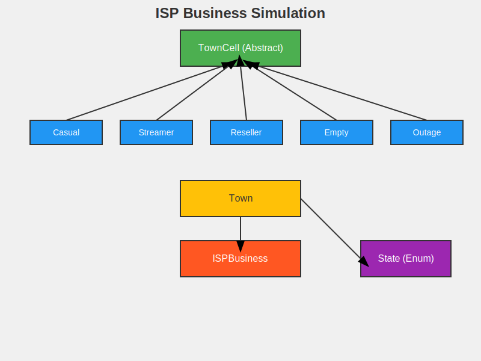

# ISP Business Simulation



## Description

ISP Business Simulation is a Java-based project that models the behavior of an Internet Service Provider's network over time. The simulation represents a town as a grid of cells, each cell representing a different type of internet usage or network state. This project demonstrates advanced object-oriented programming concepts, including inheritance, polymorphism, and file I/O operations.

## Features

- Simulates a town grid with different cell types (Casual, Streamer, Reseller, Empty, Outage)
- Implements rules for cell state transitions based on neighboring cells
- Allows initialization of the town grid from a file or random generation
- Calculates ISP profit based on the number of Casual users
- Simulates the town's evolution over 12 months (cycles)
- Provides a console interface for user interaction

## Project Structure

The project is organized into several classes within the `edu.iastate.cs228.hw1` package:

- `TownCell`: Abstract base class for all cell types
- `Casual`, `Streamer`, `Reseller`, `Empty`, `Outage`: Concrete implementations of different cell types
- `Town`: Represents the grid of cells
- `ISPBusiness`: Contains the main simulation logic and user interface
- `State`: Enum representing different cell states

## How to Run

1. Compile all Java files in the `edu.iastate.cs228.hw1` package.
2. Run the `ISPBusiness` class.
3. Follow the prompts to either:
   a. Load a grid from a file
   b. Generate a random grid

## Usage

```java
public class SimulationDemo {
    public static void main(String[] args) {
        // Create a town from a file
        Town town = new Town("gridfile.txt");

        // Or create a random town
        Town randomTown = new Town(10, 10);
        randomTown.randomInit(42); // seed = 42

        // Run the simulation
        for (int i = 0; i < 12; i++) {
            town = ISPBusiness.updatePlain(town);
            int profit = ISPBusiness.getProfit(town);
            System.out.println("Month " + (i+1) + " profit: " + profit);
        }
    }
}
```

## Class Descriptions

1. `TownCell`: Abstract base class for all cell types. Implements common methods like `census()`.
2. `Casual`, `Streamer`, `Reseller`, `Empty`, `Outage`: Represent different cell types with specific behaviors.
3. `Town`: Manages the grid of cells, can be initialized from a file or randomly.
4. `ISPBusiness`: Contains methods for updating the town and calculating profit.
5. `State`: Enum representing the possible states of a cell.

## Testing

The project includes JUnit tests for each class to ensure correct functionality. Run these tests to verify the implementation:

- `CasualTest`
- `StreamerTest`
- `ResellerTest`
- `EmptyTest`
- `OutageTest`
- `TownTest`
- `ISPBusinessTest`

## Future Improvements

- Implement a graphical user interface for visualization
- Add more sophisticated profit calculation models
- Introduce new cell types or behaviors
- Implement multi-threaded simulation for larger grids

## Author

Abhay Prasanna Rao
